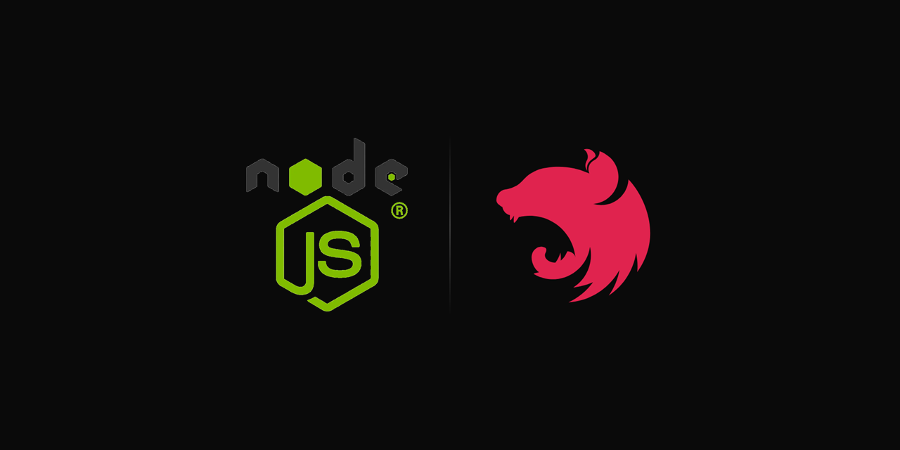

---

# 🐈 Stack Backend del Proyecto
A continuación se resumen las principales tecnologías del proyecto y el motivo por el que se utilizan. No se incluyen todas las dependencias.

* Node.js 24.18.0

* [**Nest.js 11:**](https://youtu.be/wsqcg5ZtUMM?si=o0rmZsPYwMlrl7Ed) _Framework semi-opinionado_ que combina la _arquitectura modular de Angular_ con la _flexibilidad de Express.js_, ofreciendo estructura escalable, soporte nativo de TypeScript e _inyección de dependencias_, y fácil integración con _ORMs_, _GraphQL_ y _microservicios_ para _APIs_ empresariales robustas.

* [**TypeScript 7:**](https://youtu.be/fUgxxhI_bvc?si=rRY7NTzsONRSwyNN) Agrega _tipado estático_ al lenguaje, permitiendo detectar errores durante el desarrollo y mejorar el _autocompletado_, la _refactorización_ y el _mantenimiento del código_. Además, permite tener el mismo lenguaje de programación en frontend y backend.

* [**Prisma ORM 7:**](https://youtu.be/vUcNydH1tz0?si=mc11vxHJpcCs_5Qj) Prisma se basa en un _esquema declarativo_ (_`schema.prisma`_) como _única fuente de verdad_, que genera un _cliente tipado_ y sincroniza la base de datos mediante _migraciones versionadas_. A diferencia de _TypeORM_, donde entidades y base de datos pueden desincronizarse, Prisma garantiza consistencia explícita entre _esquema_ y BD, con _type-safety_ en _tiempo de compilación_ que reduce _errores de mapeo_.

* [**nestjs-zod:**](https://youtu.be/bUzGfrjg66M?si=PqQtfsXKDVA0HnuP) Permite utilizar la _misma sintaxis de código_ y reutilizar los mismos _esquemas de validación_ en frontend y backend de Node.js. Además, se integra con _TypeScript_, ofrece validación de tipos en _tiempo de compilación_ y validación de datos en _tiempo de ejecución (runtime)_. En frontend valida _formularios_ y _datos de entrada_, con integración con _React Hook Form_ (React) y [_Forms with Signals_ (Angular)](https://angular.dev/guide/forms/signals/validation). En backend valida _`body`_, _`query`_ y _`params`_ de las _solicitudes http_, garantizando la integridad de los datos antes de procesarlos.

* [**PostgreSQL 18:**](https://www.postgresql.org/download/) _Base de datos relacional (RDBMS)_ con _cumplimiento ACID_, _integridad referencial_ y soporte nativo para tipos avanzados como _JSONB_, que permite almacenar y consultar documentos _JSON_ de _forma binaria_ e _indexada_, ofreciendo _flexibilidad de esquema similar a MongoDB_ sin sacrificar las _transacciones_ y _relaciones_ propias de un _modelo relacional_. Es ampliamente adoptado hoy en día por su madurez, extensibilidad (extensiones como _PostGIS_, _pgvector_), rendimiento en _cargas mixtas (OLTP)_ y compatibilidad total con _Prisma_ y el ecosistema _TypeScript_.

* [**DBeaver:**](https://dbeaver.io/download/) _Cliente universal de bases de datos (GUI)_ que permite explorar, consultar y administrar la base de datos PostgreSQL de forma visual, sin escribir SQL manualmente para tareas básicas. Facilita inspeccionar tablas, ejecutar _queries_, revisar _relaciones_ y datos generados por las _migraciones de Prisma_, agilizando el _debugging_ y la validación durante el desarrollo.

> [!TIP]
> # 🎥 **Aprende**
>
> Puedes hacer clic en el nombre de cada tecnología para ver cursos y aprenderlas

# ⚙️ Configurar lo Siguiente **UNA SOLA VEZ**

## 🛠️ Antes de Empezar
Para que la configuración funcione, debes tener instalado:
* [VS Code](https://code.visualstudio.com/) o cualquier editor basado en VS Code ([Antigravity IDE](https://antigravity.google/product/antigravity-ide), [Cursor](https://cursor.com/get-started), Windsurf, etc.)

* [Git Bash](https://youtu.be/niPExbK8lSw?si=tHx4IYZBdrUmW6ey)

* [Node.js](https://nodejs.org/)

* [Claude Code](https://youtu.be/Bf7hfpItrDk?si=5pW919OUbtSqJlyP)

* [pnpm](https://pnpm.io/installation)

* [fnm](https://github.com/Schniz/fnm)

* [DBeaver](https://dbeaver.io/download/)

* [Postman](https://www.postman.com/downloads/)

> [!TIP]
> # ⚡ **Empieza de inmediato**
>
> 👍 Si quieres empezar a programar con IA sin perder tiempo configurando herramientas, utiliza **Claude Code**. Este proyecto ya incluye las configuraciones de **MCP**, **Skills** y [`AGENTS.md`](https://youtu.be/eS5HmdpcqnM?si=D7X-HFPQAfCkZ4Ks) listas para usar.
>
> 👎 Si prefieres otra IA, deberás configurar manualmente sus funcionalidades equivalentes según la forma en que esa herramienta las implemente.

## Instalar `pnpm`
1. Abrir Git Bash

2. Instalar:

```console
npm install -g pnpm@latest-11
```

3. Cerrar y volver abrir Git Bash

4. Si la instalacion es correcta, al ejecutar

```console
pnpm -v
```

Debe mostrar la version de `pnpm` instalada

## `fnm`
Para que `fnm` automáticamente al entrar a la carpeta del proyecto seleccione la versión correcta de Node.js que se especifica en el archivo `.nvmrc` que esta en la raiz del proyecto. Hacer esto:

1. Abrir Git Bash.

2. Instalar Node.js 24.18.0:

```console
fnm install 24.18.0
```

3. Copiar completo el siguiente comando y ejecutarlo:

```console
echo 'eval "$(fnm env --use-on-cd)"' >> ~/.bashrc
source ~/.bashrc
```

4. Cerrar y volver abrir Git Bash

5. Para verificar que funcione ejecutar los siguientes comandos en el siguiente orden:

```console
cd /ruta/a/carpeta/raiz/del/proyecto
```

```console
fnm current
```

```console
node -v
```

6. Debería mostrarte `v24.18.0` automáticamente, sin que hayas escrito manualmente

```console
fnm use 24.18.0
```

## ⌨️ Autocompletado, Formatear Código y Linter
Usar VS Code o cualquier editor basado en VS Code (Antigravity, Cursor, Windsurf, etc.) para instalar las siguientes extensiones:

* [ESLint](https://marketplace.visualstudio.com/items?itemName=dbaeumer.vscode-eslint)

* [Error Lens](https://marketplace.visualstudio.com/items?itemName=usernamehw.errorlens)

* [EditorConfig](https://marketplace.visualstudio.com/items?itemName=EditorConfig.EditorConfig)

* [Prettier - Code formatter](https://marketplace.visualstudio.com/items?itemName=esbenp.prettier-vscode)

* [Console Ninja](https://marketplace.visualstudio.com/items?itemName=WallabyJs.console-ninja)

* [Path Intellisense](https://marketplace.visualstudio.com/items?itemName=christian-kohler.path-intellisense)

* [Auto Import](https://marketplace.visualstudio.com/items?itemName=steoates.autoimport)

No es necesario buscar cada extensión manualmente en el marketplace: el archivo `.vscode/extensions.json` ya está configurado con esas extensiones como recomendadas. Al abrir el proyecto, el editor mostrará una notificación sugiriendo instalarlas; también puede instalarlas desde la pestaña **Extensions** filtrando por `@recommended`.

La configuración de autocompletado, formateo de código y linter ya está incluida en los siguientes archivos. No es necesario realizar modificaciones adicionales:

* `.vscode/`
* `.editorconfig`
* `.prettierrc`
* `eslint.config.mjs`

# ⚙️ Entorno de Ejecución
Obligatorio el uso de Node.js, prohibido usar alternativas como:

* [Bun](https://bun.com/)
* [Deno](https://deno.com/)

# 📦 Manejador de Paquetes
Obligatorio el uso de `pnpm`, `pnpm-lock.yaml` y `pnpm dlx <paquete>` version `>=11.0.0 <12.0.0`. Esta 🚫 **BLOQUEADO** el uso de otras alternativas como:

| Concepto ⬇️ / Nombre manejador de paquetes ➡️            | `npm`                                   | `yarn`                              |
| --------------------------------------------------------- | --------------------------------------- | ----------------------------------- |
| Lockfile                                                  | `package-lock.json`                     | `yarn.lock`                         |
| Ejecutar un paquete temporal (sin instalarlo globalmente) | `npx <paquete>`<br>`npm exec <paquete>` | `yarn dlx <paquete>` *(Yarn Berry)* |

# 🟢 Administrador de Versiones para Node.js
Obligatorio el uso de `fnm`. Está prohibido usar alternativas como:

* nvm
* volta

Este proyecto usa Node.js 24.18.0

# 🏷️ Alias
Para todos los comandos de `pnpm` usar el alias `pn`

# 📦 Instalar Paquetes

```console
pn i
```

# ▶️ Scripts de Desarrollo

| Comando          | Ambiente      | Variable de Entorno            |
| ---------------- | ------------- | ------------------------------ |
| `pn start:local` | Local host    | `environments/.env.localhost`  |
| `pn start:test`  | Pruebas       | `environments/.env.test`       |
| `pn start:prod`  | Producción    | `environments/.env.production` |

# 🚀 Generar Carpeta `dist` (build) para Desplegar

```console
pn build
```

Hay **un solo** script de build, sin ambiente, porque el `dist` generado es idéntico para todos los ambientes. El build no hardcodea los valores de las variables de entorno dentro del código compilado: deja escrito `process.env.VARIABLE`, que se lee hasta que la aplicación arranca. El ambiente se elige al **ejecutar** el `dist`, no al generarlo.

# Ejecutar Carpeta `dist` con Archivos de Compilación
Estos scripts ejecutan el `dist` que previamente se generó con `pn build`. Requieren que exista la carpeta `dist`, de lo contrario fallan.

| Comando        | Ambiente      | Variable de Entorno            |
| -------------- | ------------- | ------------------------------ |
| `pn dist:test` | Pruebas       | `environments/.env.test`       |
| `pn dist:prod` | Producción    | `environments/.env.production` |

# 🪲 Scripts para Hacer Debugging

> [!TIP]
> # Deja de escribir `console.log()` para ver valores de variables, mejor usa el debugging

Cada entorno tiene su propio script de debugging y su configuración equivalente en `.vscode/launch.json`:

| Comando          | Ambiente      | Variable de Entorno            | Configuración de `.vscode/launch.json` |
| ---------------- | ------------- | ------------------------------ | -------------------------------------- |
| `pn debug:local` | Local host    | `environments/.env.localhost`  | `🪲 Nest: debug local host`            |
| `pn debug:test`  | Pruebas       | `environments/.env.test`       | `🪲 Nest: debug pruebas`               |
| `pn debug:prod`  | Producción    | `environments/.env.production` | `🪲 Nest: debug producción`            |

Los scripts `start:*` no sirven para depurar porque no abren el inspector de Node. Solo los scripts `debug:*` usan `nest start --debug --watch`.

Para que los scripts `debug:*` sirvan para depurar se tiene que escribir `debugger;` en el código.

**Ejemplo:**

```ts
import { ConfigService } from '@nestjs/config';
import { Controller, Get } from '@nestjs/common';
import { ENV_VARS, EnvironmentClass } from 'environments/env-config';

@ApiTags('Example')
@Controller('endpoint-example')
export class ExampleController {
  constructor(private env: ConfigService<EnvironmentClass>) {}

  @ApiOperation({ summary: 'Obtiene el ambiente de ejecución' })
  @Get('my-environment')
  getEnvironment() {
    const NODE_ENV = this.env.get(ENV_VARS.NODE_ENV);
    debugger; // debugger breakpoint
    return `Ambiente ${NODE_ENV}`
  }
}
```

## 🤔 Diferencia entre Launch y Attach
Existen dos formas de ejecutar el debugger desde VS Code (o cualquier editor basado en VS Code).

La única diferencia es **quién arranca el backend**, y de ahí se deriva **quién elige el entorno**:

|                            | **Launch**                        | **Attach**                               |
| -------------------------- | --------------------------------- | ---------------------------------------- |
| ¿Quién arranca el backend? | El editor, al presionar `F5`      | El desarrollador, en la terminal         |
| ¿Quién elige el entorno?   | La configuración de `launch.json` | El script que se ejecutó en la terminal  |
| Backend ya en ejecución    | Lo arranca de cero                | Se adjunta al que ya está corriendo      |

En ambas formas, el debugger se vuelve a adjuntar automáticamente cada vez que `--watch` reinicia el proceso durante el **Hot Reload** (reinicio automático de la aplicación), por lo que los breakpoints continúan funcionando después de guardar un archivo.

## ❔ ¿Cual Usar?
**Launch:** Es la forma recomendada porque ejecuta y depura automaticamente en un solo paso sin escribir comandos manualmente.

**Attach:** Es menos práctico de usar porque requiere ejecutar comandos manualmente.

## 1️⃣ Launch: el editor ejecuta el script (recomendado)
1. Si el backend ya esta ejecutandose con `pn start:local`, `pn start:test` o `pn start:prod`, deténgalo antes de iniciar el debugging. De lo contrario, se producirán errores.

2. Colocar los breakpoints, escribiendo en el código:

```ts
debugger;
```

3. Abrir la pestaña Ejecucion y Depuración (Run and Debug)

4. Seleccionar el entorno en la lista desplegable con el entorno que se quiere depurar, según la tabla de scripts:

```txt
🪲 Nest: debug local host

🪲 Nest: debug pruebas

🪲 Nest: debug producción
```

5. Para que el editor de codigo ejecute el backend, presionar:
   * `F5` en un computador de escritorio.
   * `Fn + F5` en un computador portátil.

6. En el editor de codigo abrir el archivo que contiene `debugger;`

7. Consumir el endpoint que se quiere depurar.

## 2️⃣ Attach: adjuntarse a un proceso ya iniciado
1. Si el backend ya esta ejecutandose con `pn start:local`, `pn start:test` o `pn start:prod`, deténgalo antes de iniciar el debugging. De lo contrario, se producirán errores.

2. Colocar los breakpoints, escribiendo en el código:

```ts
debugger;
```

3. Ejecutar en la terminal **UNO** de los siguientes scripts con el entorno que se quiere depurar:

```console
pn debug:local

pn debug:test

pn debug:prod
```

4. Abrir la pestaña Ejecucion y Depuración (Run and Debug)

5. En la lista desplegable seleccionar la opción `🔗 Nest: attach al proceso (puerto 9000)`.

6. Para adjuntarse al proceso que ya está en ejecución, presionar:
   * `F5` en un computador de escritorio.
   * `Fn + F5` en un computador portátil.

7. En el editor de codigo abrir el archivo que contiene `debugger;`

8. Consumir el endpoint que se quiere depurar.

# 📖 Swagger
1. Ejecutar uno de los siguientes comandos dependiendo del ambiente donde se quiere abrir el swagger:

```console
pn start:local

pn start:test
```

Swagger solamente funciona en los ambientes de Local host y Pruebas, NO en Producción

***Razón:*** La documentacion de la API nunca deberia estar expuesta de forma publica en producción por seguridad informática.

2. Abrir una pestaña en el navegador y escribir la siguiente url donde puedes ver la interfaz grafica del swagger:

```txt
http://localhost:PORT/docs
```

Reemplazar `PORT` por el valor de la variable de entorno `PORT` definida en el archivo `environments/.env.localhost` o `environments/.env.test` del ambiente que se levantó.

Cada ambiente usa un puerto distinto, así que la URL cambia según el comando que se haya ejecutado. El puerto también aparece impreso en la consola al arrancar la aplicación.

3. Además de la interfaz gráfica, el documento OpenAPI en formato JSON está disponible en:

```txt
http://localhost:PORT/docs-json
```

Sirve para importar la API en Postman, Insomnia o generar clientes automáticamente.

# Arquitectura del Proyecto

> [!TIP]
> # 🧠 **Aprende antes de pedir cambios**
>
> No te limites a pedirle a la IA *"hazme X"* sin entender cómo funciona la arquitectura del proyecto.
>
> Hazle preguntas a la IA sobre:
>
> 1. [`AGENTS.md`](https://youtu.be/eS5HmdpcqnM?si=D7X-HFPQAfCkZ4Ks)
> 2. `.claude/skills/***`
> 3. Los **"🔗 Enlaces"**
>
> Hasta comprender cómo funciona el proyecto.
>
> Aunque es un texto largo, aprenderás la arquitectura, buenas prácticas y a detectar revisando el código, cuando la IA alucina

# [🔗 Enlace - HTTP Cats - Explicación de los status HTTP](https://http.cat/)

# 🤖 Uso de IA

> [!CAUTION]
> # ⚠️ **IMPORTANTE** 🚨
>
> ****Ignorar esta sección ocasionará que la IA genere código que no respeta la arquitectura, estructura ni las convenciones del proyecto, produciendo código legacy, inconsistente, desordenado y con malas practicas****

## Principales IA para Desarrollo de Software

| Empresa ⬇️ / Plataforma ➡️ | Web                                                                                     | Desktop                                                               | Terminal / Bash / CLI                                              |
| ------------------------ | --------------------------------------------------------------------------------------- | --------------------------------------------------------------------- | ------------------------------------------------------------------ |
| Anthropic                | [Claude Web](https://claude.ai/)                                                        | [Claude Desktop](https://youtu.be/DYwZy7VNKws?si=cXTPumpZ3Jr9rNn9)    | [Claude Code](https://youtu.be/Bf7hfpItrDk?si=wjUIcIgtDX_Loyey)    |
| Open AI                  | [Chat GPT](https://chatgpt.com/)                                                        | [GPT Codex Desktop](https://youtu.be/bgx8ownl3O4?si=TzbOntfYIBVN1PGU) | [Codex](https://youtu.be/Ub-K1n4YYsg?si=EoIXGCzEa4ZxyRqA)          |
| Google                   | [Google AI Studio](https://aistudio.google.com/) / [Gemini](https://gemini.google.com/) | [Antigravity 2.0](https://antigravity.google/product/antigravity-2)   | [Antigravity CLI](https://youtu.be/bdEqIchP4x4?si=gRf6iLggXuzy_cq) |
| Anomaly Innovations      | [`opencode web`](https://opencode.ai/docs/web/)                                         | [Open Code Desktop](https://youtu.be/_SVSv2Y59P0?si=LT2S0z10t1FBxlB6) | [Open Code CLI](https://youtu.be/2gO8WyctqMk?si=aNvHlf23tKfrN-Z3)  |
| Cursor                   | [Cursor Web](https://cursor.com/agents)                                                 | [Cursor Desktop](https://youtu.be/XWsOQTqVl0w?si=0OVGRnYSCH46v2zf)    | [Cursor CLI](https://cursor.com/es/cli)                            |

> [!TIP]
> # 🧠 Mira estos enlaces 🔗 para que aprendas de IA enfocada en desarrollo de Software:
>
> ## 1. [Benchmark de IA](https://artificialanalysis.ai/)
> ## 2. [Prompts para desarrollo full stack con IA](https://github.com/DanielPinedaM/prompt-engineering/tree/main)
> ## 3. [Categorización de los tipos de IA: Modelos, Harnesses y Orquestadores](https://youtu.be/_HxDbdItVcs?si=VB6SHcZB1enB2Qvl)
> ## 4. [Mejores Modelos de IA](https://youtu.be/EPz00z1ACPc?si=Dkw3zECIk1d84YxX)
> ## 5. [Mejores Harnesses de IA](https://youtu.be/Fzn9uWRRDXM?si=NJJmsOYuzTXl_aad)
> ## 6. [Mejores Orquestadores de IA](https://youtu.be/rANNn5fIVmg?si=RxFAUjPUEYzXJpbq)
> ## 7. [Desarrollo de software con IA: MCP, CLI, RAG](https://youtu.be/sn1o1Hr1pJs)

## ✏️ Edición de Código
Este proyecto esta configurado para usar _IAs de pago y desde la terminal_. **NO** sirve si usas IAs gratis o desde una pagina web, porque estan limitadas.

**Razones:**
* Si copias y pegas codigo desde plataforma web al proyecto, es probable que cometas errores

Las IAs de pago y desde la terminal tienen mejoras respecto a otras plataformas:

* Mayor comprensión del proyecto y de la estructura completa del código (_contexto_ y _tokens_).

* Acceso al sistema operativo (archivos y carpetas) y capacidad para ejecutar comandos.

* Capacidad para realizar cambios respetando la arquitectura del proyecto.

* Uso de Skills y MCP para reducir las _alucinaciones_ de la IA, permitiéndole a la IA consultar documentación oficial actualizada y seguir buenas prácticas.

# 🐈 Configurar Nest.js para que Funcione con IA
Estas configuraciones ya estan listas para funcionar. Solo debes seguir los pasos a continuación para verificar que funcionen correctamente.

# Antes de Probar que Funcione Nest.js con IA
Hacer esto:

1. Abrir Git Bash

2. Abrir la carpeta del proyecto
```console
cd /ruta/a/carpeta/raiz/del/proyecto
```

3. Ejecutar claude con todos los permisos:

```console
claude --dangerously-skip-permissions
```

# [📜 `AGENTS.md`](https://youtu.be/eS5HmdpcqnM?si=D7X-HFPQAfCkZ4Ks)
Es un prompt que siempre se envia a Claude. Sirve para que Claude:
* Respete la arquitectura de software del proyecto.

* Consulte la [documentación oficial de Prisma ORM ](https://www.prisma.io/docs)

* Use Prisma ORM moderno y no legacy.

Para probar que funcione envia este prompt a Claude:

```txt
citarme textualmente Architecture CRITICAL `arch-`
```

La salida debe contener algo similar a esto:

```bash
1. Architecture (CRITICAL)

   - arch-avoid-circular-deps - Avoid circular module dependencies
```

# Diferencia Entre Skills y MCP

**Skill:** Es un archivo Markdown llamado `SKILL.md` que contiene instrucciones para enseñarle a la IA cómo ejecutar un proceso, o para darle conocimiento sobre un tema. La IA carga ese contenido directamente en su contexto antes de responder.

**Model Context Protocol (MCP):** Es un protocolo (no es exactamente una API REST, aunque es similar) que permite que una IA se comunique con sistemas externos —herramientas, servicios o fuentes de datos— de forma estandarizada. Un servidor MCP puede exponer *tools* (funciones que la IA puede invocar), *resources* (datos) y *prompts* (plantillas)

## Diferencia Entre Prisma MCP y Skills de Prisma

# INCOMPLETO - FALTA COMPLETAR ESTO

# Skills

## 🔗 Enlaces con Respositorios de Skills

* ## [Skills escritas por el equipo oficial de Prisma](https://github.com/prisma/skills)

* ## [Web de Vercel con múltiples repositorios de Skills sobre distintos temas](https://www.skills.sh/)

* ## [Skills para UI / Maquetación](https://www.ui-skills.com/)

## ¿Como Configurar Skills?

> [!NOTE]
>
> Esto es una guia. **NO** debes hacer lo siguiente porque las skills ya estan configuradas
>
> Para explicar como configurar skills, se usa como ejemplo [`nestjs-best-practices`](https://www.skills.sh/kadajett/agent-nestjs-skills/nestjs-best-practices)

Hay dos formas:

### Forma 1 - Usando Comando de [www.skills.sh](https://www.skills.sh/):

1. Buscar una skill en [www.skills.sh](https://www.skills.sh/)

2. Ejecutar el comando de la skill a descargar:

```bash
pn dlx skills add https://github.com/kadajett/agent-nestjs-skills --skill nestjs-best-practices
```

3. La terminal hace las siguientes preguntas:

* ¿Para que IA instalar la skill?
Seleccionar Claude Code

* ¿Cual es el alcance de la skill? (Install scope)
Seleccionar Project

Hay dos alcances:

| Alcance | Disponibilidad                                                       | ¿Se puede compartir con el equipo mediante Git? |
| ------- | -------------------------------------------------------------------- | ----------------------------------------------- |
| Global  | Disponible para la persona que la instala en **todos sus proyectos** | ❌ **No**                                      |
| Project | Disponible **solo en el proyecto actual** donde se instala           | ✅ **Sí**                                      |

4. Mover `.agents\skills\nestjs-best-practices` a `.claude\skills\nestjs-best-practices`

5. Eliminar `skills-lock.json`

### Forma 2 - Descargar skill sin comando
1. Buscar un repositorio con una skill

2. Descargar el repositorio

3. Mover la skill a `.claude\skills\NOMBRE-DE-LA-SKILL\SKILL.md`

## 🌿 `git-commit`
Por cada feature terminada hacer un commit antes de solicitar nuevas modificaciones a la IA. Evita acumular demasiados cambios, ya que puedes perder el contexto de lo que la IA está realizando y cometer errores.

Trabajar bajo el principio:

> 1 commit = 1 feature

El skill `.claude\skills\git-commit\SKILL.md` te permite realizar commits.

***Ejemplos de prompt:***

```console
git commit y git push
```

## `nestjs-best-practices`
Es la skill de Nest.js mas descargada de [skills.sh](https://www.skills.sh/kadajett/agent-nestjs-skills/nestjs-best-practices). Contiene reglas para seguir buenas practicas de Nest.js.

## 🌐 `api-agent`

> [!CAUTION]
> # ⚠️ Advertencia
>
> Usar esta skill con ciudado, es muy buena, pero
>
> Si intentas automatizar un proceso o solucionar un bug existente con esta skill sin entender el código, es probable que introduzcas nuevos bugs.

Sirve para que la IA (Claude Code) desde la terminal pueda controlar el backend: arrancarlo, hacerle peticiones HTTP a sus endpoints con `curl` y leer los logs del servidor sin hacerlo manualmente.

`api-agent` se puede usar para lo siguiente:

| Pregunta ⬇️ / Modo ➡️                                                          | Modo AUTOMATIZAR                          | Modo DEPURAR                                                   |
|---------------------------------------------------------------------------------|-------------------------------------------|----------------------------------------------------------------|
| Para qué sirve                                                                  | ejecutar o automatizar un flujo de la app | encontrar la causa de un bug o de un comportamiento incorrecto |
| ¿Escribe codigo de testing en Jest, Vitest, etc?                                | ❌ No                                     | ❌ No                                                         |
| Ejemplo de uso                                                                  | Insert masivos a la base de datos         | El endpoint X no esta retornando Y, corrigelo                  |
| Modifica código fuente                                                          | ❌ No                                     | ✅ Sí                                                         |
| Diagnostica (logs del server, `curl -i`/`-v`, cuerpo y headers de la respuesta) | ❌ No                                     | ✅ Sí                                                         |
| ¿Ejecuta ESLint?                                                                | ❌ No                                     | ✅ sí, pero solo si ESLint está configurado                   |
| ¿Genera el build de la aplicacion?                                              | ❌ No                                     | ✅ Sí                                                         |
| ¿Pide usuario y contraseña y hace login?                                        | ✅ Sí                                     | ✅ Sí                                                         |

**SIEMPRE** que necesites controlar el backend con la IA:
1. Detener la ejecucion del proyecto

2. Usar este prompt para llamar la skill `api-agent`:

***Ejemplo de Prompt:***
```txt
/api-agent <<< Aqui describir de forma MUY DETALLADA
la funcionalidad a testear o el proceso a automatizar,
para mejorar el resultado es bueno decirle a Claude
rutas especificas de donde estan los archivos, controllers, services, endpoints, etc.
que necesita para ejecutar el proceso >>>
```

## 🗄️ `database-normalization`

> [!CAUTION]
> # ⚠️ Advertencia
>
> Esta skill modifica el esquema de base de datos y puede introducir bugs

La informacion de la skill es copiada de [Wikipedia](https://en.wikipedia.org/wiki/Database_normalization)

Normaliza el esquema de base de datos aplicando las formas normales en orden, sin saltar pasos, hasta el nivel que elijas. Es agnóstica al ORM y al motor de base de datos

Primero pregunta hasta qué forma normal normalizar. Como el orden es progresivo, elegir `3NF` ejecuta `UNF` → `1NF` → `2NF` → `3NF`, y las formas normales posteriores ni se ejecutan ni se leen.

| Rango                  | Formas normales      | Cuándo usarlo                                                                       |
| ---------------------- | -------------------- | ----------------------------------------------------------------------------------- |
| Básico                 | `1NF`, `2NF`, `3NF`  | 3NF es lo que la industria considera "normalizado". Elimina la mayoría de anomalías |
| Claves solapadas       | `EKNF`, `BCNF`       | Varias claves candidatas que se solapan                                             |
| Dependencias complejas | `4NF`, `ETNF`, `5NF` | Dependencias multivaluadas y de join                                                |
| Académico              | `DKNF`, `6NF`        | 6NF explota el número de tablas, **no** usar en OLTP                                |

Estructura de la skill:

| Ruta                                                      | Qué contiene                                                                                                                                          |
|-----------------------------------------------------------|-------------------------------------------------------------------------------------------------------------------------------------------------------|
| `.claude\skills\database-normalization\rules\theory.md`   | Teoría general. Se lee **siempre**                                                                                                                    |
| `.claude\skills\database-normalization\rules\<SIGLA>.md`  | Teoría de cada forma normal. Solo se lee, nunca se modifica                                                                                           |
| `.claude\skills\database-normalization\result\<SIGLA>.md` | El modelo relacional del proyecto en el paso de la forma normal seleccionada, con sus primary key y foreign key. Lo genera la skill en cada ejecución |

Después de documentar cada paso, aplica la forma normal elegida al schema del ORM y deja el código que lo consume coherente con el nuevo esquema. Si el proyecto usa migrations, la genera pero **no la ejecuta** sin que lo autorices.

***Ejemplo de Prompt:***
```txt
/database-normalization normalizar base de datos
```

# MCP

# [🔗 Enlace - Repositorios de MCP](https://mcpservers.org/es/)

## ¿Como Configurar MCP?

> [!NOTE]
>
> Esto es una guia. **NO** debes hacer lo siguiente porque el MCP ya esta configurado
>
> Para explicar como configurar MCP, se usa como ejemplo **prisma MCP**

1. Este comando instala **prisma MCP** con el `--scope project`. Es decir, configura el MCP para que se ejecute únicamente en este proyecto y pueda compartirse con el resto del equipo mediante Git:

```bash
!claude mcp add --transport http --scope project prisma https://mcp.prisma.io/mcp
```

La salida de la terminal debe ser similar a esto:

```bash
Added HTTP MCP server prisma with URL: https://mcp.prisma.io/mcp to project config
File modified: C:\Users\User\Documents\arquitectura\Nest-JS\.mcp.json

El servidor MCP de Prisma se agregó correctamente al scope del proyecto, quedando registrado en .mcp.json.
```

2. Verificar de que el comando automaticamente haya creado archivo `.mcp.json` en la ruta raiz del proyecto que contenga:

```json
{
  "mcpServers": {
    "prisma": {
      "type": "http",
      "url": "https://mcp.prisma.io/mcp"
    }
  }
}
```

3. Cerrar terminal de Claude

4. Abrir Git Bash y ejecutar Claude con todos los permisos:

```console
claude --dangerously-skip-permissions
```

5. Ejecutar:

```console
/mcp
```

6. Seleccionar las siguientes opciones:

* Prisma
* Authenticate

7. Se abre una nueva pestaña en el navegador

8. Iniciar sesion con GitHub o Google

9. Click en "autorize"

10. En el navegador y el la consola de Claude debe aparecer mensaje "Authentication successful"

## prisma MCP
Sirve para que la IA acceda a la [documentación oficial de Prisma](https://www.prisma.io/docs). Esto permite que la IA tenga datos actualizados de como escribir codigo de Prisma.

También cuenta con muchas otras funcionalidades (tools) disponibles en este enlace. Es **IMPORTANTE** que leas este enlace:

# [🔗 Enlace - Tools de **prisma MCP**](https://www.prisma.io/docs/ai/tools/mcp-server)

Para que funcione el **Prisma MCP** solamente la primera vez que haces `git pull` del repositorio es necesario hacer los siguientes pasos:

1. Seleccionar la opcion

```txt
2. Use this and all future MCP servers in this project
```

2. Para verificar conexión al MCP, ejecutar:

```console
!claude mcp list
```

La salida de la terminal debe ser:
```console
prisma: https://mcp.prisma.io/mcp (HTTP) - ⏸ Pending approval (run `claude` to approve)
```

```console
/mcp
```

La salida de la terminal debe ser:
```console
❯ prisma · ✔ connected · 22 tools
```

Ejecutar este prompt:
```console
usar la tool search_prisma_documentation de Prisma MCP para citar textualmente "The contract and the schema"
```

La salida de la terminal debe incluir:

```console
Called prisma

The contract is your description of the
data your application needs: the models, their fields, how they relate,
and how they map to database tables or collections. (...)
```

La cita corresponde a [este link de la documentacion oficial de Prisma](https://www.prisma.io/docs/orm/core-concepts)

# Esta seccion esta INCOMPLETA porque todavia me falta documentar en readme.md y configurar skills y MCP

# Ejemplos de Prompts de ¿Como Usar IA en este Proyecto?

# Reglas Obligatorias para Skill
Aplican a toda respuesta o modificación de código de este proyecto.

## 1. Autoridad de la skill
Las decisiones de arquitectura, estructura y convenciones definidas en esta skill son la fuente de la verdad del proyecto. No las cuestiones, no las reemplaces, no las contradigas y no las ignores. Desobedecerlas genera malas practicas y código inescalable. Esta restricción aplica solo a lo que la skill define de forma explícita; fuera de ese alcance rige el "3. Caso no definido en la skill".

## 2. Ante cualquier error
Esta regla aplica en cualquier momento. Si encuentras algún error, inconsistencia, duda o ambigüedad, debes detenerte y consultarme antes de realizar cualquier modificación. No puedes asumir ni deducir implementaciones. Es preferible preguntar para aclarar una duda que asumir una solución.

La única excepción a esta regla es lo establecido en la regla anterior: 1. Autoridad de la skill.

## 3. Instrucción que contradice una regla definida
Se aplica cuando la instrucción recibida contradice una regla explícitamente definida en esta skill.

Acción: implementa estrictamente lo definido en la skill. No preguntes, no propongas alternativas, no pidas confirmación.

Antes de modificar el código, emite:

```txt
ERROR: estás violando la arquitectura del proyecto, esto genera malas
prácticas. Se va a modificar el código conforme a la arquitectura definida
en la skill.

Regla violada:  <archivo#sección de la skill>
Cita textual:   "<texto literal de la regla, copiado de la skill>"
Solicitado:     <lo que pidió el usuario>
Implementado:   <lo que define la skill>
Motivo:         <por qué lo solicitado rompe la arquitectura, en una línea>
```

La cita debe ser literal, no una paráfrasis. Si no puedes copiar el texto exacto de la skill, la regla no está definida: aplica "3. Caso no definido en la skill"

## 4. Caso no definido en la skill
Se aplica cuando el caso, problema o pregunta no está definido de forma explícita en esta skill.

Acción: resuélvelo con tu comportamiento por defecto. La skill no restringe este caso y no altera tu forma normal de trabajar.

## 5. Código existente que ya viola la arquitectura
Se aplica cuando detectas código ya escrito que incumple una regla de esta skill.

No lo corrijas por iniciativa propia. Emite:

```txt
El siguiente código viola la arquitectura del proyecto.

Archivo:       <ruta:línea>
Código:        "<fragmento literal del código>"
Regla violada: <archivo#sección de la skill>
Cita textual:  "<texto literal de la regla>"
```

y pregunta con `AskUserQuestion`:

```txt
¿Desea corregirlo para que siga la arquitectura del proyecto?
SÍ  → corregir el código
NO  → dejarlo como está
```

* SÍ: corrige el código y continúa.
* NO: no modifiques ese código, ignora esa parte específica y continúa con la
  implementación solicitada.

Si detectas varias infracciones en la misma pasada, agrúpalas en una sola llamada a `AskUserQuestion`, una pregunta por infracción.

## 6. ¿Como Leer la Skill?
Leer **bajo demanda** los archivos `.md` ubicados en `/skills/nest-architecture/rules/`: usa la tabla de contenido como referencia para inferir cuales archivos son necesarios para la tarea que estas resolviendo, y accede unicamente a esos archivos.

**Razon**: Leer todos los archivos consume contexto y tokens innecesariamente.

### Tabla de Contenido

# INCOMPLETO - aqui me falta escribir la tabla de contenido con la estructura de archivos, carpetas y titulos de /rules

# 🔌 Consumo de API

> [!WARNING]
> # ⚠️ **IMPORTANTE** 🚨
>
> **esta seccion esta INCOMPLETA**
>
> **me fallta:**
> **escribir las reglas para que funcione interceptor global para hacer peticiones HTTP en Nest JS**
>  **pasarle esto a Claude para verificar de que no hayan errores**
> **agregar Ejemplo incorrecto y correcto de como consumir API**

MEJORAR REDACCION DE ESTO:

Los interceptor permiten estandarizar la estructura de las respuestas de *CUALQUIER* API, para que todas las API que se llaman en este backend de Nest, respondan con este formato:
{
  success: boolean;
  status: number;
  message: string;
  data: T;
}

## 🔀 Flujo para Consumir API:

```txt
TU SERVICIO DE NEST
        (UsersService, AuthService, etc.)
                         │
                         │
                         ▼
                HttpService (Nest)
          (wrapper sobre AxiosInstance)
                         │
                         │
                         │
                         ├───────────────────────────────┐
                         │                               │
                         ▼                               │
              axiosRef (AxiosInstance)                  │
        ┌────────────────────────────────────┐          │
        │                                    │          │
        │  Request Interceptors  ◄───────────┤          │
        │                                    │          │
        │           Axios                    │          │
        │                                    │          │
        │  Response Interceptors ◄───────────┤          │
        │                                    │          │
        └────────────────────────────────────┘          │
                         │                               │
                         ▼                               │
                   API EXTERNA                           │
                                                         │
────────────────────────────────────────────────────────────────────
```

No existe un "interceptor de HttpService". Cuando dices "interceptor de HttpModule", en realidad te refieres a los interceptores registrados sobre la AxiosInstance que HttpModule creó y que HttpService expone mediante axiosRef. Esa es la razón por la que, si toda la aplicación usa HttpService, un único interceptor registrado sobre axiosRef afecta todas esas peticiones.

## Reglas para Consumo de API
1. todas las peticiones HTTP externas tienen que pasar por HttpService

2. Solamente debe exisitr una sola instancia de `HttpService`, es decir:

```txt
Un HttpModule → un HttpService → una AxiosInstance.
```

Esta PROHIBIDO registrar HttpModule mas de una sola vez

ESTA REGLA ES MUY IMPORTANTE porque incumplir esta regla hace que el consumo de APIs sea inconsistente y rompe con el contrato

{
  success: boolean;
  status: number;
  message: string;
  data: T;
}

3. NO usar axios directo. Esta PROHIBIDO importar axios:

```console
import axios from 'axios';
```

4. Obligatorio usar `HttpService` **DIRECTO**

5. Está **prohibido** usar:
* `try/catch`
* .catch()

6. Al llamar API esta **prohibido** propagar los errores con  `throw new Error()`.

7. TODAS las peticiones HTTP se TIENEN que validar con

```ts
  if (success) {
    // codigo cuando peticion HTTP es exitosa
  } else {
    // codigo cuando peticion HTTP es erronea
  }
```

8. La razon de esto es que el interceptor ya se encarga de estandarizar y manejar los errores

